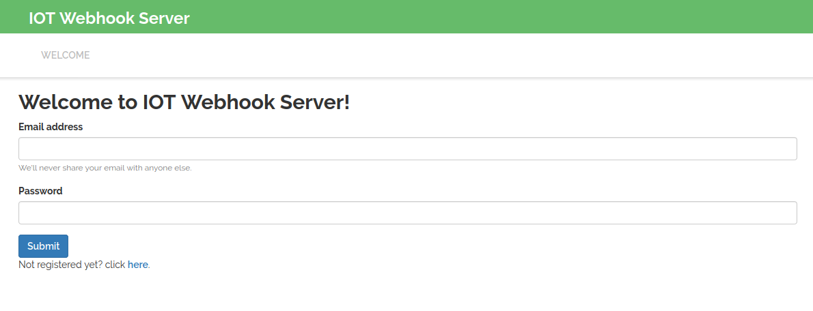
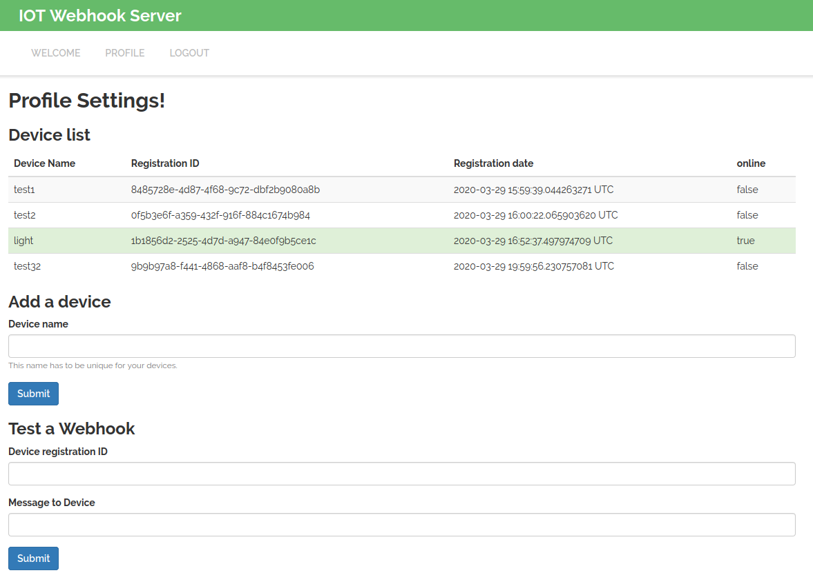

# IOT Webhook Server

This is a small server which can connect to IOT devices behind NAT routers, in order
to send webhooks from the internet to your IOT device. It can be integrated
with ifttt.com, in order to automatize your home devices using google home, etc.
It is intended for Arduino developers who want an easy solution for home automation. The goal is to be lightweight and simple, without many features.


## How to use the server?


### User Interface

Once you have the server running, the front page will look the following:


Next, you have to create an account. I recommend to not use one of your real passwords. It is encrypted in the database, however, the server has not TLS functionality (yet). Once you created an account and logged in, there will appear a new tab, called profile. Everything you need happens here.



In the device list, you can see all devices registered. Devices which are currently connected to the server are marked in green. Below, you can add a new device, by using a unique device name. Further below, you can manually test a webhook.

### Sending a webhook to the server

Webhooks are send by a HTTP post request to the URL "/api/webhook". They consists of the fields `id` and `message`, encoded as application/URL. The id has to be the registration id of you device. The message is the text you want to send, which is send to your IOT device.


### Registering a device at the server

To register a device to the server, you need to connect as a websocket client to the URL "/ws". Once connected, send the JSON object
```
{
    "username":"<<username>>",
    "password": "<<password>>",
    "object": "<<device name>>"
}
```
to the websocket server. Then, you are registered and will receive the webhooks.

You can find examples in python and for the ESP8266 in the examples folder.

## How to setup the server

### Compile
To compile the code, you need the rust 1.4 compiler (newer versions or slightly older ones will probably also work). Use the command `cargo build --release` to compile the code to a binary. The binary will be located in target/release/iot_webhook_server.

### Database
Create a SQLite database and run "database_create_tables.sql" on it, to create the database tables needed for the server.


### Create environmental variables
You need to provide the location of your database and the website URL as an environmental variable. The easiest way doing this, is by creating a ".env" file.
The variables you need to provide are "DATABASE_URL" and "SERVER_URL".

## DISCLAIMER

Please note: all code in this repo is released for use "AS IS" without any warranties of any kind, including, but not limited to their installation, use, or performance. We disclaim any and all warranties, either express or implied. We do not warrant that the technology will meet your requirements, that the operation thereof will be uninterrupted or error-free, or that any errors will be corrected.
